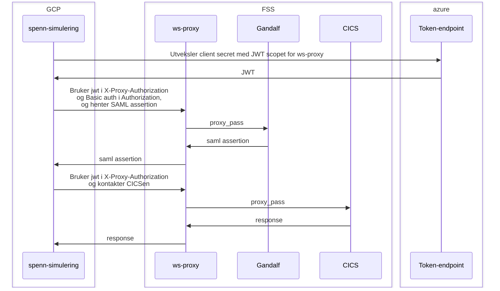

WS Proxy
========

Skaper en forbindelse mellom GCP og SOAP-tjenester i FSS.

## Hvordan

Alle requests må ha JWT token som Bearer authentication for at ws-proxy skal slippe de gjennom.
Dette må sendes som `X-Proxy-Authorization`-header.

Derfor må alle konsumenter være i accessPolicy-listen til ws-proxy.

Hvorfor `X-Proxy-Authorization`? Jo det har seg slik at Java sin `HttpClient` _fjerner_  `Proxy-Authorization` på alle HTTPS-tilkoblinger automatisk.


### Gandalf

Klienter oppfordres til å bruke Gandalf for å få SAML-assertion fremfor den klassiske STS-en.
Fordi Gandalf også krever autentisering så må dette legges i `Authorization`-headeren.

```
curl \
  -H "Authorization: Basic <basic..>" \
  -H "X-Proxy-Authorization: Bearer <jwt>" \
  https://ws-proxy...fss-pub.nais.io/gandalf/rest/v1/sts/samltoken
```



